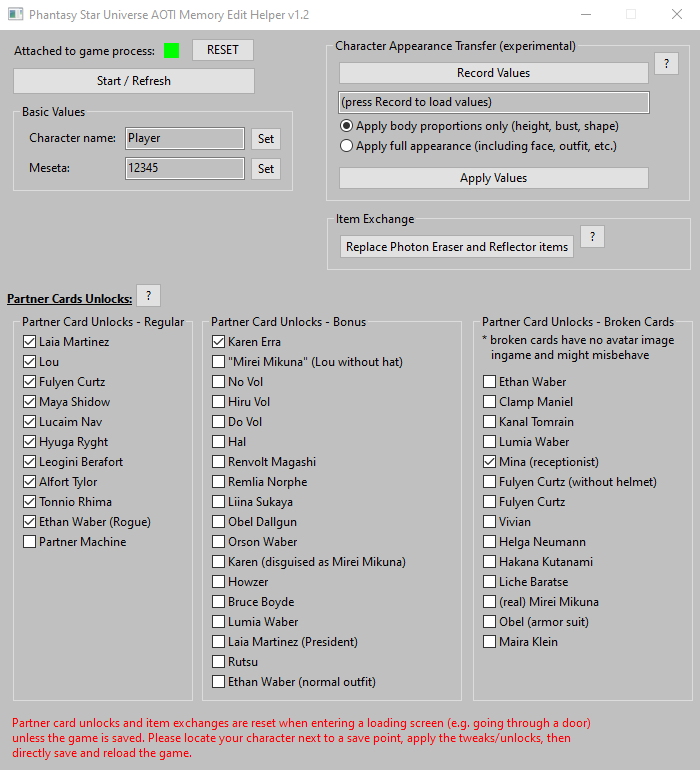

# Phantasy Star Universe AOTI offline memory editor

This is a memory edit helper (some may say trainer) for the offline version of the game **Phantasy Star Universe: Ambition of the Illuminus** (or PSU AOTI for short).

Its main functions are:

- unlock NPC partner cards, which includes ...
    - ... all of the regular story unlocks
    - ... Karen Erra's card, which would only be available through save import from base PSU normally
    - ... a lot of hidden cards, which are normally unobtainable
- edit Meseta (money) value
- edit a character's name
    - this is normally not offered by the game
- edit a character's body proportions by transfering another character's
    - makes up for the lack of a corresponding option in the in-game makeover shop which lacks this feature despite offering to change everything else
- exchange the useless inventory items "Photon Eraser" and "Photon Reflector" on characters imported from base PSU
    - replaces them with the Sonic and Tails room decoration statues normally received when creating a new non-imported character in AOTI

The tool is a table for Cheat Engine ([cheatengine.org](https://cheatengine.org/)) with forms attached to it and an integrated Lua script to do the heavy lifting.
It can be exported as a standalone `.exe` from Cheat Engine, see [how to build a standalone exe](#how-to-build-a-standalone-exe).

## Game Compatibility

This tool has been tested with the offline version of Phantasy Star Universe AOTI with the community patch applied which removes the GameGuard integration.
It expects the game's executable used to start the game to be called `PsuIlluminusOff.exe`, if it uses a different name it will not work.

Tip: if your version uses a `_suIlluminus.exe` to start the game, renaming that to `PsuIlluminusOff.exe` might work.

### Note for Linux/WINE users

When executed from the same Proton/WINE prefix as the game, this tool also works on Linux.
It is advised to use Cheat Engine's save as exe functionality and [build a standalone executable](#how-to-build-a-standalone-exe) first and use that.
It **must be built as 32bit target** otherwise attaching to the game's process will not work under WINE.

## How to build a standalone exe

1. First, download the [AOTI_memory_edit_helper.CT](https://raw.githubusercontent.com/M4he/PSU-AOTI-MemEdit-Helper/main/AOTI_memory_edit_helper.CT) file.
2. Open Cheat Engine and load the `.CT` file using "File" > "Load". You may deny the script execution when prompted.
3. Use "File" > "Save as..." to open the "Save file as" dialog.
4. At the bottom of the "Save file as" dialog change the file type to "Cheat Engine Trainer Standalone (*.EXE)".
5. In the "Exe Trainer Generator" dialog, select "Target is 32-bit", use the "Change EXE Icon" and use any icon file from your PC (otherwise generation will fail) and press "Generate".

## Usage instructions

> It is always recommended to make backups of your save file before any modifications.
> The save is located at `My Documents\SEGA\PHANTASY STAR UNIVERSE Illuminus\BACKUP\`.
> (yes, the folder is called "BACKUP" but contains the actual save!)

Startup:

1. Open up the memory edit helper first. Either by [building the exe](#how-to-build-a-standalone-exe) beforehand and starting it or loading the [AOTI_memory_edit_helper.CT](https://raw.githubusercontent.com/M4he/PSU-AOTI-MemEdit-Helper/main/AOTI_memory_edit_helper.CT) file into Cheat Engine and allowing script execution.
2. Open up the game. The "Attached to game process:" indicator should turn green.

### Editing character name or meseta (money)

1. Load your save game (character) and once in-game, click "Start / Refresh".
2. Edit character name and/or meseta in the fields below the button and press "Set" next to them.
3. Trigger a loading screen (e.g. by going through a door) to refresh the values on screen.
4. Save the game at a save point to make changes permanent.

### Unlocking partner cards

> **Note:**
> Changes to partner card unlocks will be directly applied but are reset once entering any loading screen (e.g. going through a door).
> The game needs to be saved and reloaded directly for the changes to be both visible and permanent!

1. Start the game in offline story mode and load your character.
2. Position your character next to a save point.
3. In the tool's window press "Start / Refresh". Your character's name should appear in the corresponding text filed. If not, redo the procedure!
4. Use the checkboxes in the tool's window to add/remove partner cards as desired.
5. After choosing the partner cards, switch back to the game and save the game to any desired save slot.
6. From the game's system menu use the logout option to return to the title screen and then load the character from the slot you just saved to.

### Exchanging Photon Eraser and Photon Reflector items

This feature of the tool allows you to get rid of the items "Photon Eraser" and "Photon Reflector" on characters imported from base PSU to AOTI using the game's save import function.
These items permanently take up inventory slots but are of no use in AOTI at all and cannot be sold or stored away.
The tool can replace both items with the Sonic and Tails room decoration statues that you would normally receive on new non-imported AOTI characters on game start but don't on imported ones.
In contrast to the Photon tools, those items can also be stored and removed from the inventory.

> **Note:**
> Changes to the inventory will be directly applied but are reset once entering any loading screen (e.g. going through a door).
> The game needs to be saved and reloaded directly for the changes to be both visible and permanent!

1. Start the game in offline story mode and load your character.
2. Position your character next to a save point.
3. In the tool's window press "Start / Refresh". Your character's name should appear in the corresponding text filed. If not, redo the procedure!
4. Use the "Replace Photon Eraser and Reflector items" button in the tool's window.
5. Switch back to the game and save the game to any desired save slot.
6. From the game's system menu use the logout option to return to the title screen and then load the character from the slot you just saved to.

### Transferring character appearance

This feature of the tool is experimental and intended to make up for the lack of "edit body proportions" option in the makeover shop in-game.

1. From the title screen, start a new game/character to enter character creation.
2. Choose the same base type as the character you want to change (CAST, Human, etc.).
3. Adjust the new character's appearance to what you want.
4. Complete the character creation and enter the game.
5. Once in-game, press "Record Values" in the tool window. There is no need to save the game with the new character.
6. Return to the game's title screen and load the target character you want to apply the appearance to.
7. Once in-game, press "Apply Values" to transfer the recorded appearance to the current character.
8. Trigger a loading screen (e.g. by going through a door) to refresh the character display on screen.
9. Save the game at a save point to make changes permanent.

## Acknowledgements

Thanks goes to:

- the PSU fan community and authors of the community patch for PSU AOTI offline, making this possible in the first place
- YouTube users **jie 8**, **cybxrmurdxr** and **GamerTime1226** for their video tutorials on PSU AOTI memory editing
- the authors of Cheat Engine for providing the tool

## Disclaimer

This tool is a fan project just for educational purposes and not associated with Sega Corporation or Sega of America.

It is provided "as-is" with no warranty.

SEGA, PHANTASY STAR and PHANTASY STAR UNIVERSE are registered trademarks of their respective companies.
